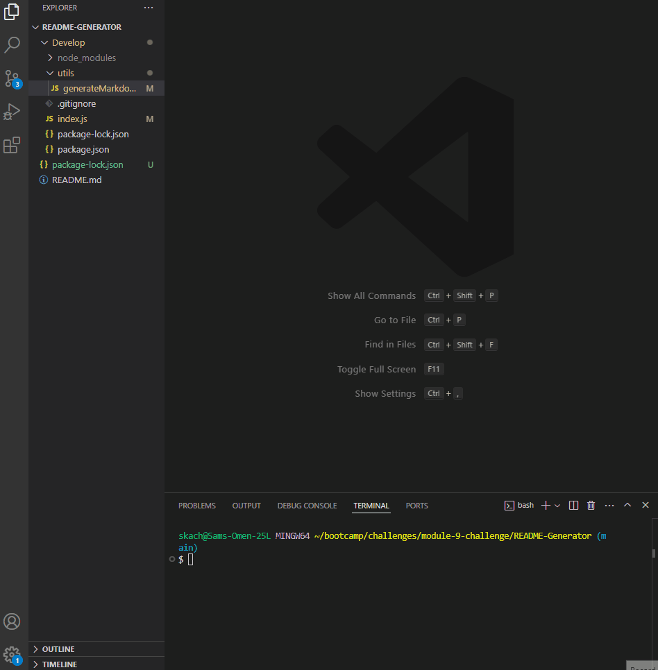

# README-Generator

## Description

This CLI tool automates the creation of professional `README.md` files. It prompts the user for various project details and generates a structured README based on the provided information.

- **What was your motivation?** 
  The motivation behind this project was to streamline the process of creating README files, ensuring consistency and saving time for developers.

- **Why did you build this project?** 
  The project was built to help developers quickly generate high-quality README files, reducing the manual effort required and minimizing errors.

- **What problem does it solve?** 
  It simplifies and automates the creation of README files, which can often be a tedious and repetitive task.

- **What did you learn?** 
  Through this project, I gained experience in using Node.js modules like `inquirer` for interactive prompts and `fs` for file handling.

## Table of Contents

- [Description](#description)
- [Installation Instructions](#installation-instructions)
- [Project Usage](#project-usage)
- [License](#license)
- [Contribution Instructions](#contribution-instructions)
- [Testing Instructions](#testing-instructions)

## Installation Instructions

To install and use the CLI README Generator, follow these steps:

1. Clone the repository: `git clone https://github.com/ogchromebook/README-Generator`
2. Navigate to the project directory: `cd cli-readme-generator/develop`
3. Install dependencies: `npm install`

## Project Usage

To generate a README.md file, run the following command:

```bash
npm start
```

You will be prompted to provide various details about your project. The tool will generate a `README.md` file based on your responses.



## License

This project is licensed under the MIT License. For more details, see the [MIT License](https://opensource.org/licenses/MIT).

## Contribution Instructions

Contributions are welcome! Please fork the repository and submit a pull request with your improvements or bug fixes. For more information on contributing, refer to the [Contributor Covenant](https://www.contributor-covenant.org/).

## Testing Instructions

There are currently no test developed for this project, outside of using it of course!

